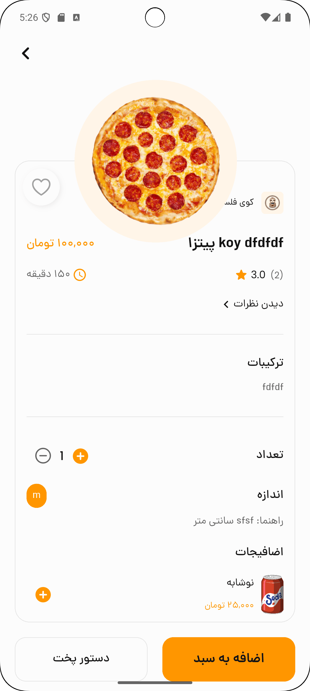

# Food Delivery Project
[پارسی ](README_FA.md)


## Table of Contents

This repository contains a full-stack food delivery application, including:

- **Backend**: Django REST API
- **Frontend**: ReactJS web client
- **Mobile App**: Flutter cross-platform application

Each component has its own dedicated README with detailed setup and usage instructions. See the sections below for links.

### 🔗 Links to Part READMEs
- [Backend (Django)](backend/README.md)
- [Frontend (ReactJS)](reactjs/README.md)
- [Mobile App (Flutter)](mobile/README.md)


---

### Overview
A complete food delivery solution with advanced features:

- **Coverage Area**: Define restaurant service zones on a map
- **Multi-Branch Support**: Manage multiple restaurant locations
- **Financial Estimations**: Automated revenue and cost calculations
- **User Address Handling**: Store and validate delivery addresses
- **Delivery Speed Management**: Track and optimize order fulfilment times

### Architecture

| Component | Technology            | Directory       |
|-----------|-----------------------|-----------------|
| Backend   | Django + DRF          | `/backend`      |
| Frontend  | ReactJS               | `/frontend`     |
| Mobile    | Flutter               | `/mobile_app`   |


### Project Structure

```plaintext
.
├── README.md
├── LICENSE
├── docker-compose.yml
├── .gitignore
├── .github/
│   └── workflows/
│       └── ci-cd.yml
├── backend/
│   ├── Dockerfile
│   ├── requirements.txt
│   ├── app/
│   │   ├── __init__.py
│   │   ├── main.py
│   │   ├── models/
│   │   ├── routers/
│   │   ├── services/
│   │   ├── schemas/
│   │   └── utils/
│   └── tests/
│       ├── test_main.py
│       └── test_services.py
└── frontend/
    ├── Dockerfile
    ├── pubspec.yaml
    ├── lib/
    │   ├── main.dart
    │   └── src/
    │       ├── blocs/
    │       ├── models/
    │       ├── pages/
    │       ├── widgets/
    │       └── utils/
    └── test/
```

### Getting Started

#### Prerequisites
- Python 3.8+
- Node.js 14+
- Flutter SDK 2.0+
- PostgreSQL or SQLite

#### Installation

##### 1. Backend (Django)
```bash
cd backend
pip install -r requirements.txt
python manage.py migrate
python manage.py runserver
```

##### 2. Frontend (ReactJS)
```bash
cd frontend
npm install
npm start
```

##### 3. Mobile App (Flutter)
```bash
cd mobile_app
flutter pub get
flutter run
```

### Usage

1. Register a restaurant or user account
2. Define your restaurant's coverage area on the map
3. Add menu items and set up branches
4. Place orders via web or mobile
5. Track delivery in real-time

### 📸 Screenshots

#### Web Frontend

| Home                                                               | Map Screen                                                        |
|--------------------------------------------------------------------|-------------------------------------------------------------------|
|  |  |


#### Mobile App
| Home                                                                 | Food Screen                                                         |
|----------------------------------------------------------------------|---------------------------------------------------------------------|
|  |  |


📄 Read this in [Persian](README_FA.md)
