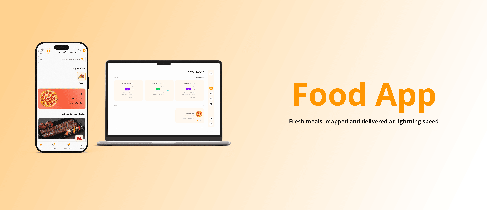
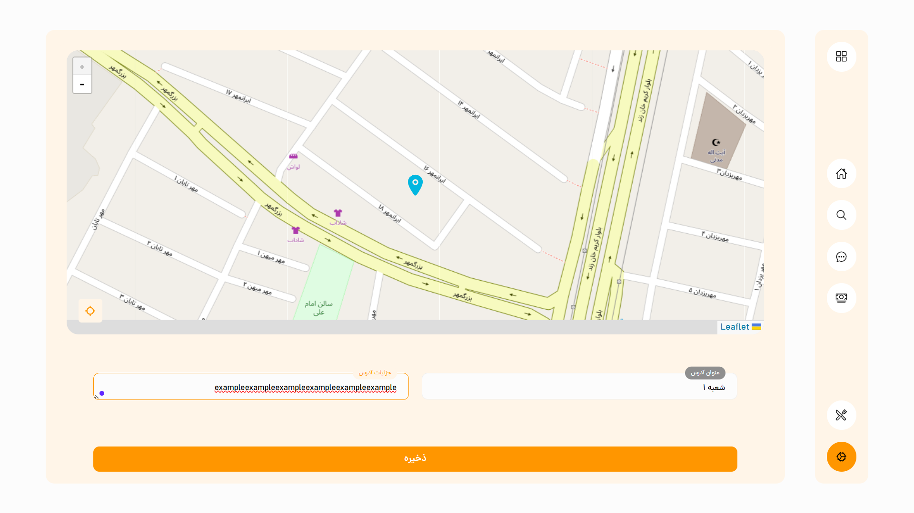
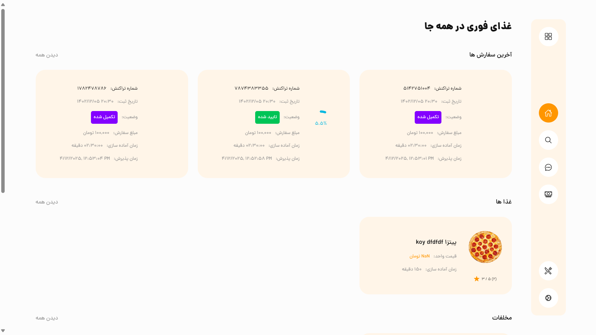
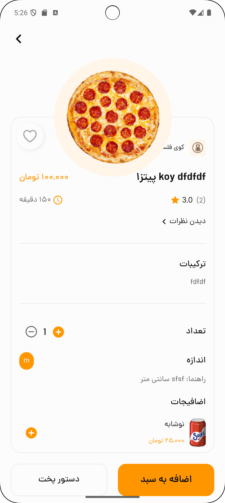

<div dir="rtl">

# پروژه سفارش غذای آنلاین

این مخزن شامل یک سامانه کامل سفارش غذای آنلاین است که شامل:

- **بک‌اند**: API با Django REST Framework  
- **فرانت‌اند**: کلاینت وب با ReactJS  
- **اپ موبایل**: برنامه چندسکویی با Flutter  

هر بخش دارای فایل README جداگانه برای راه‌اندازی و استفاده می‌باشد. لینک‌ها در بخش‌های زیر ارائه شده است.

---

### ویژگی‌ها

۱. **تنظیم محدوده پوشش** برای رستوران روی نقشه  
۲. **پشتیبانی از چند شعبه**  
۳. **برآورد مالی** خودکار هزینه‌ها و درآمد  
۴. **مدیریت آدرس کاربران** با ذخیره و اعتبارسنجی  
۵. **مدیریت سرعت تحویل** سفارش‌ها  

### معماری

| بخش       | فناوری                  | پوشه           |
|-----------|-------------------------|----------------|
| بک‌اند    | Django + DRF            | `/backend`     |
| فرانت‌اند | ReactJS                 | `/frontend`    |
| موبایل    | Flutter                 | `/mobile_app`  |

### شروع به کار

#### پیش‌نیازها

- Python 3.8+  
- Node.js 14+  
- Flutter SDK 2.0+  
- PostgreSQL یا SQLite  

#### نصب

##### ۱. بک‌اند (Django)
```bash
cd backend
pip install -r requirements.txt
python manage.py migrate
python manage.py runserver
```

##### ۲. فرانت‌اند (ReactJS)
```bash
cd frontend
npm install
npm start
```

##### ۳. اپ موبایل (Flutter)
```bash
cd mobile_app
flutter pub get
flutter run
```

### نحوه استفاده

۱. ثبت‌نام رستوران یا کاربر  
۲. تعیین محدوده پوشش رستوران روی نقشه  
۳. افزودن منو و راه‌اندازی شعبه‌ها  
۴. ثبت سفارش از طریق وب یا اپلیکیشن  
۵. پیگیری زمان واقعی تحویل  

### 📸 تصاویر

#### وب فرانت‌اند
| صفحه نقشه | صفحه خانه |
|----------------------|----------------------|
|||

#### اپ موبایل
| صفحه غذا | صفحه خانه |
|----------------------|----------------------|
|||  

### 🔗 لینک فایل‌های README بخش‌ها

- [بک‌اند (Django)](../backend/README.md)  
- [فرانت‌اند (ReactJS)](../frontend/README.md)  
- [اپ موبایل (Flutter)](../mobile_app/README.md)  

📄 این فایل را به [انگلیسی بخوانید](README.md)

</div>
