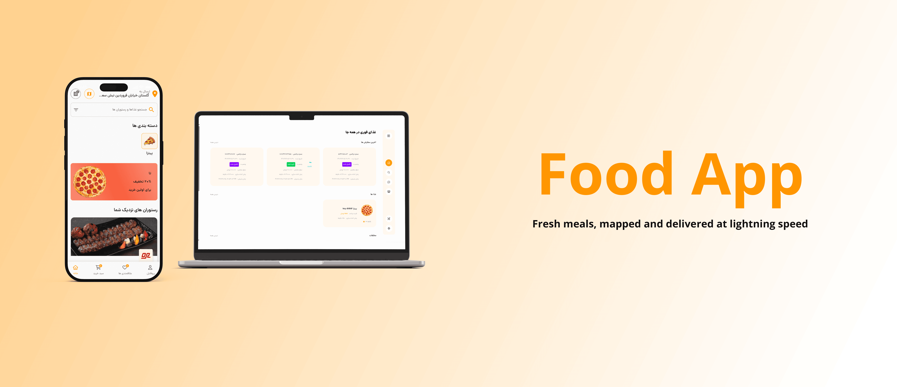
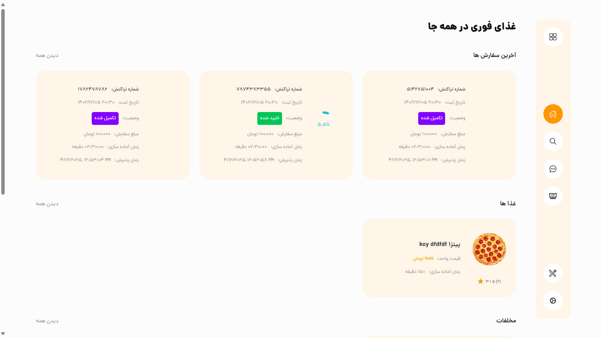
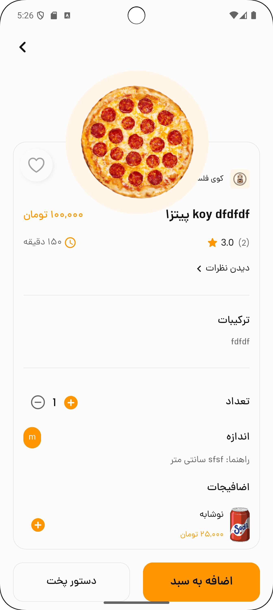
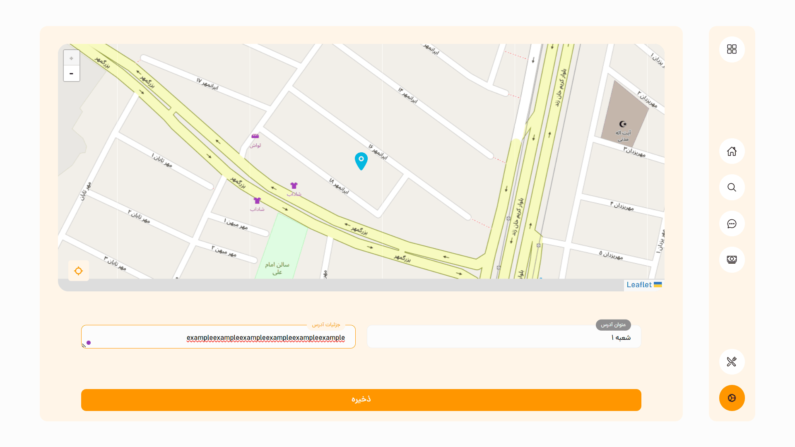

<div dir="rtl" style="text-align: right">

# 🍔 اپلیکیشن سفارش غذای آنلاین (فول استک)
[English ](README.md)

این مخزن شامل یک سامانه کامل سفارش غذای آنلاین است که شامل:

- **بک‌اند**: API با Django REST Framework  
- **فرانت‌اند**: کلاینت وب با ReactJS  
- **اپ موبایل**: برنامه چندسکویی با Flutter  

هر بخش دارای فایل README جداگانه برای راه‌اندازی و استفاده می‌باشد. لینک‌ها در بخش‌های زیر ارائه شده است.

### 🔗 لینک فایل های README
- [Backend (Django)](backend/README.md)
- [Frontend (ReactJS)](reactjs/README.md)
- [Mobile App (Flutter)](mobile/README.md)

---

## 📸 اسکرین‌شات‌ها

| اپلیکیشن موبایل | پنل مدیریت |
|-----------------|-------------|
|  |  |
|  |  |

---

### ✨ ویژگی‌ها

۱. **تنظیم محدوده پوشش** برای رستوران روی نقشه  
۲. **پشتیبانی از چند شعبه**  
۳. **برآورد مالی** خودکار هزینه‌ها و درآمد  
۴. **مدیریت آدرس کاربران** با ذخیره و اعتبارسنجی  
۵. **مدیریت سرعت تحویل** سفارش‌ها  

---

### معماری

| بخش       | فناوری                  | پوشه           |
|-----------|-------------------------|----------------|
| بک‌اند    | Django + DRF            | `/backend`     |
| فرانت‌اند | ReactJS                 | `/frontend`    |
| موبایل    | Flutter                 | `/mobile_app`  |

---

### ساختار پروژه

```plaintext
.
├── README.md
├── LICENSE
├── docker-compose.yml
├── .gitignore
├── .github/
│   └── workflows/
│       └── ci-cd.yml
├── backend/
│   ├── Dockerfile
│   ├── requirements.txt
│   ├── app/
│   │   ├── __init__.py
│   │   ├── main.py
│   │   ├── models/
│   │   ├── routers/
│   │   ├── services/
│   │   ├── schemas/
│   │   └── utils/
│   └── tests/
│       ├── test_main.py
│       └── test_services.py
└── frontend/
    ├── Dockerfile
    ├── pubspec.yaml
    ├── lib/
    │   ├── main.dart
    │   └── src/
    │       ├── blocs/
    │       ├── models/
    │       ├── pages/
    │       ├── widgets/
    │       └── utils/
    └── test/
```
---
### شروع به کار

#### پیش‌نیازها

- Python 3.8+  
- Node.js 14+  
- Flutter SDK 2.0+  
- PostgreSQL یا SQLite  

#### نصب

##### ۱. بک‌اند (Django)
```bash
cd backend
pip install -r requirements.txt
python manage.py migrate
python manage.py runserver
```

##### ۲. فرانت‌اند (ReactJS)
```bash
cd frontend
npm install
npm start
```

##### ۳. اپ موبایل (Flutter)
```bash
cd mobile_app
flutter pub get
flutter run
```

---

### نحوه استفاده

۱. ثبت‌نام رستوران یا کاربر  
۲. تعیین محدوده پوشش رستوران روی نقشه  
۳. افزودن منو و راه‌اندازی شعبه‌ها  
۴. ثبت سفارش از طریق وب یا اپلیکیشن  
۵. پیگیری زمان واقعی تحویل  


📄 این فایل را به [انگلیسی بخوانید](README.md)

</div>
