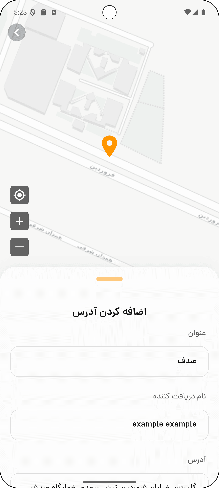

# Mobile App (Flutter) – Food Delivery Project
[پارسی ](README_FA.md)

This directory contains the Flutter mobile application for the Food Delivery Project.

## Table of Contents

- [Overview](#overview)
- [Tech Stack](#tech-stack)
- [Prerequisites](#prerequisites)
- [Installation](#installation)
- [Configuration](#configuration)
- [Running the App](#running-the-app)
- [Screenshots](#screenshots)
- [Testing](#testing)
- [Contributing](#contributing)

## Overview

The Flutter app provides a cross-platform mobile interface for customers and delivery agents, allowing them to:
- Browse restaurants and menus
- Place and track orders in real-time
- View coverage areas on a map
- Receive push notifications for order updates

## Tech Stack

- **Flutter 3.3x**
- **Dart 3.x**
- **Provider** (state management)
- **HTTP** (API communication)
- **Google Maps Flutter** (map integration)
- **Firebase** (notifications, analytics)

## Prerequisites

- Flutter SDK 2.0 or higher
- Dart 2.12 or higher
- Xcode (for iOS builds)
- Android SDK & Android Studio (for Android builds)

## Installation

1. Clone the repository and navigate to the mobile_app directory:
   ```bash
   git clone https://github.com/DivSlayer/Food-App.git
   cd mobile_app
   ```

2. Install dependencies:
   ```bash
   flutter pub get
   ```

3. (Optional) Generate JSON serialization code:
   ```bash
   flutter pub run build_runner build --delete-conflicting-outputs
   ```

## Configuration

1. Open `links.dart` at `resource` directory:
   ```dotenv
    static String server = 'http://127.0.0.1:80';
   ```
    Change the address with server address

2. Ensure the backend server is running and the `process_trans` command has been executed.

## Running the App

- **Android**:
  ```bash
  flutter run -d android
  ```
- **iOS**:
  ```bash
  flutter run -d ios
  ```
  
## Screenshots
| Home Screen                                                  | Food Screen                                                   | Map Screen                                                   |
|--------------------------------------------------------------|---------------------------------------------------------------|--------------------------------------------------------------|
|  |  |  | 


## Testing

Run widget and integration tests:
```bash
flutter test
```

## Contributing

1. Fork the repo and create a new branch.
2. Follow existing code style and patterns.
3. Write tests for new features or bug fixes.
4. Submit a pull request.
