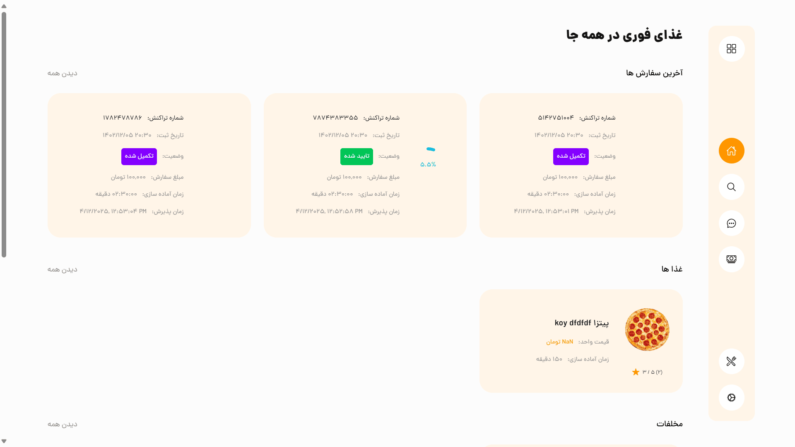
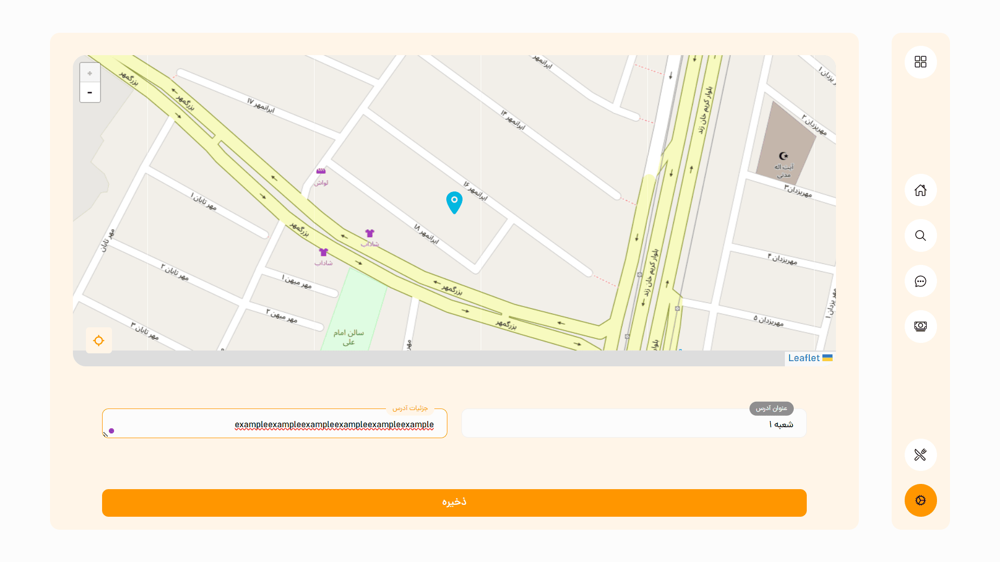

# Frontend (ReactJS) – Food Delivery Project

This directory contains the ReactJS web client used by restaurants to manage their menu, branches, and coverage areas. Written in TypeScript with a strict models‐based architecture for clarity and scalability.

## Table of Contents

- [Overview](#overview)
- [Tech Stack](#tech-stack)
- [Prerequisites](#prerequisites)
- [Installation](#installation)
- [Configuration](#configuration)
- [Running Locally](#running-locally)
- [Building for Production](#building-for-production)
- [Folder Structure](#folder-structure)
- [Screenshots](#screenshots)
- [Testing](#testing)

## Overview

A single‐page app for restaurant owners to:
- **Manage Menus**: Add, edit, or remove dishes and categories
- **Branch Control**: View and configure multiple locations
- **Coverage Area**: Draw and adjust service zones on an interactive map
- **Order Insights**: See incoming orders and quick stats

## Tech Stack

- **React 18** + **TypeScript**
- **Redux Toolkit** for state management
- **React Router** for navigation
- **Axios** for API calls
- **Leaflet** + **react-leaflet** for map rendering
- **Zod** models & schemas for type-safe data validation

## Prerequisites

- Node.js 14+
- npm or yarn

## Installation

```bash
cd frontend
npm install   # or yarn
```

## Configuration

Open `package.json` file at the project root:
```json lines
{
  "proxy": "http://127.0.0.1/", //Change this to server address
  "options": {
    "proxy": "http://127.0.0.1/" //Change this to server address
  }
}
```

## Running Locally

```bash
npm start    # or yarn start
```
Open http://localhost:3000 in your browser.

## Building for Production

```bash
npm run build   # or yarn build
```
Deploy the contents of `build/` to your static-hosting provider.

## Folder Structure

```
frontend/
├─ src/
│  ├─ blocs/         # axios instances & endpoints
│  ├─ components/    # shared UI pieces
│  ├─ context/       # Auth context for login and register
│  ├─ hooks/         # custom React hooks
│  ├─ models/        # Zod schemas & TS types
│  ├─ screens/       # route-driven views
│  ├─ styles/        # global & utility CSS
│  └─ App.tsx
├─ public/
│  └─ index.html
└─ package.json
```

## Screenshots

| Home                                                         | Map Screen                                                  | Comment Screen                                                  |
|--------------------------------------------------------------|-------------------------------------------------------------|-----------------------------------------------------------------|
|  |  |  |


## Testing

```bash
npm test       # or yarn test
npm run lint   # or yarn lint
```
