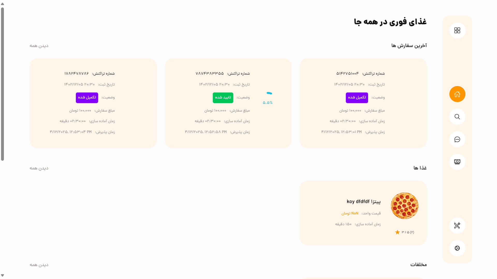
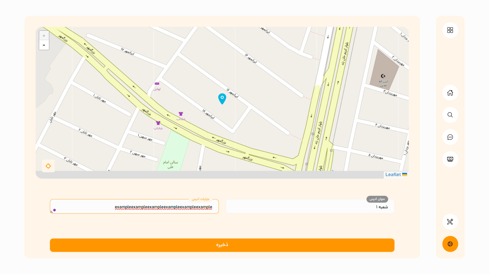
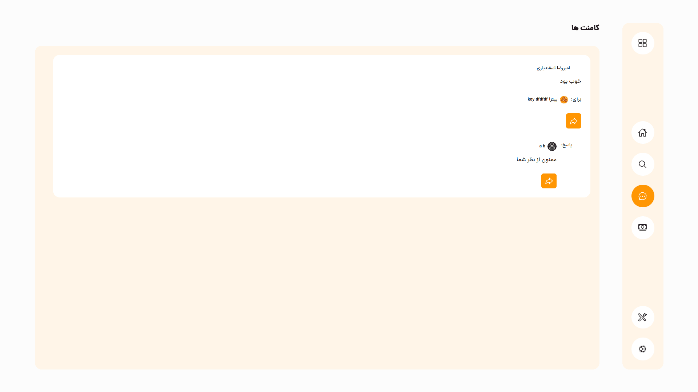

<div dir="rtl" align="right" style="text-align: right">

# فرانت‌اند (ReactJS) – پروژه سفارش غذای آنلاین

این پوشه شامل کلاینت وب ReactJS است که توسط رستوران‌ها برای مدیریت منو، شعب، و محدوده‌های پوشش استفاده می‌شود. نوشته‌شده با TypeScript و معماری مبتنی بر مدل‌ها برای خوانایی و مقیاس‌پذیری.

## فهرست

- [معرفی](#معرفی)
- [فناوری‌ها](#فناوری‌ها)
- [پیش‌نیازها](#پیش‌نیازها)
- [نصب](#نصب)
- [پیکربندی](#پیکربندی)
- [اجرای محلی](#اجرای-محلی)
- [ساخت برای تولید](#ساخت-برای-تولید)
- [ساختار پروژه](#ساختار-پروژه)
- [آزمون‌ها](#آزمون‌ها)

## معرفی

یک اپ تک‌صفحه‌ای برای مالکین رستوران‌ها به منظور:
- **مدیریت منو**: اضافه، ویرایش یا حذف غذاها و دسته‌بندی‌ها
- **کنترل شعب**: مشاهده و تنظیم چندین شعبه
- **محدوده پوشش**: ترسیم و ویرایش نواحی سرویس‌دهی روی نقشه
- **آمار سفارش‌ها**: مشاهده سفارش‌های دریافتی و آمار سریع

## فناوری‌ها

- **React 18** + **TypeScript**
- **Redux Toolkit** برای مدیریت وضعیت
- **React Router** برای ناوبری
- **Axios** برای درخواست‌های API
- **Leaflet** + **react-leaflet** برای رندر نقشه
- **Zod** اسکیمای مدل‌ها و اعتبارسنجی نوع‌دار

## پیش‌نیازها

- Node.js نسخه 14 یا بالاتر
- npm یا yarn

## نصب

```bash
cd frontend
npm install   # یا yarn
```

## پیکربندی

 فایل `package.json` موجود در پوشه اصلی را باز کنید:
```json lines
{
  "proxy": "http://127.0.0.1/", //Change this to server address
  "options": {
    "proxy": "http://127.0.0.1/" //Change this to server address
  }
}
```

## اجرای پروژه

```bash
npm start    # یا yarn start
```
صفحه در http://localhost:3000 باز می‌شود.

## ساخت برای تولید

```bash
npm run build   # یا yarn build
```
محتوای پوشه `build/` را در سرویس میزبانی استاتیک خود مستقر کنید.

## ساختار پروژه

```
frontend/
├─ src/
│  ├─ blocs/         # axios instances & endpoints
│  ├─ components/    # shared UI pieces
│  ├─ context/       # Auth context for login and register
│  ├─ hooks/         # custom React hooks
│  ├─ models/        # Zod schemas & TS types
│  ├─ screens/       # route-driven views
│  ├─ styles/        # global & utility CSS
│  └─ App.tsx
├─ public/
│  └─ index.html
└─ package.json
```
## اسکرین شات ها
| Home                                                         | Map Screen                                                  | Comment Screen                                                  |
|--------------------------------------------------------------|-------------------------------------------------------------|-----------------------------------------------------------------|
|  |  |  |

## آزمون‌ها

```bash
npm test       # یا yarn test
npm run lint   # یا yarn lint
```

</div>
